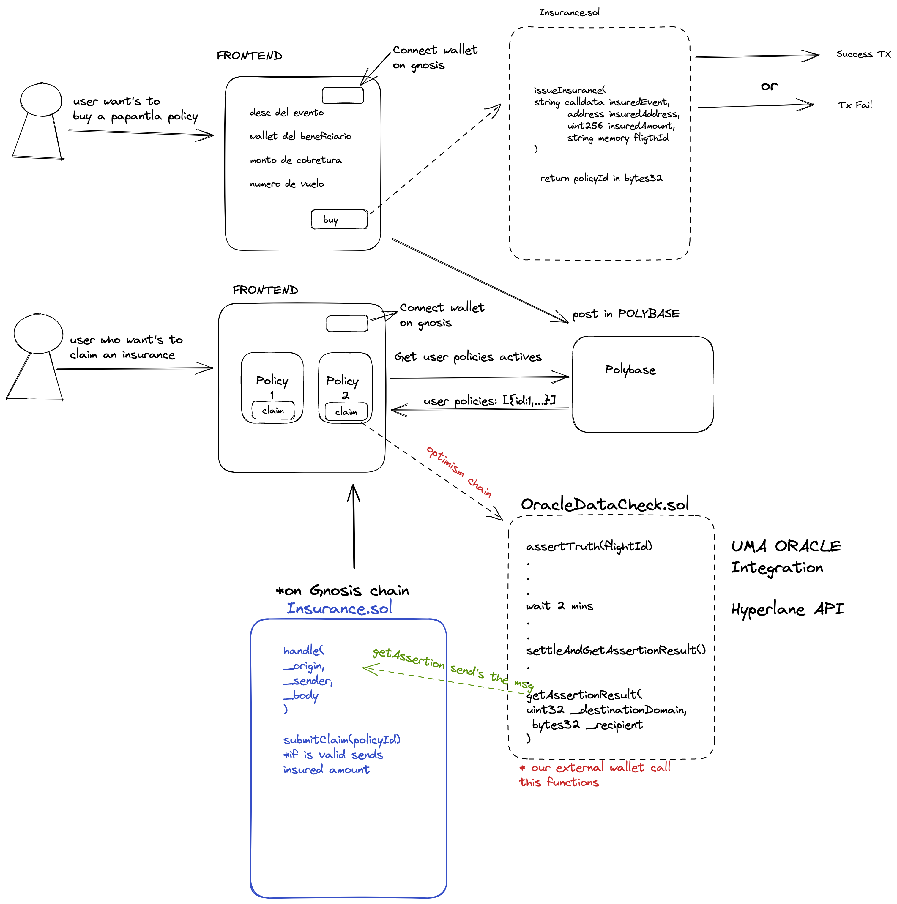

# Intro to Papantla  

<div align="center">
  <a href="https://github.com/ArturVargas/Papantla">
    
  </a>
  <h3 align="center">If your flight is cancelled, we pay you immediately. Papantla: Insurance without intermediaries..</h3>
</div>
<br/>

## Docs

### Architecture



## Next steps

1. Improve the integration with UMA and Hyperlane.
2. Connect Contracts to [Agave](https://docs.gnosischain.com/ecosystems/defi) for generate APY.
3. Code improvement and Security Audit.
4. Flight provider platform integration.

### Testnet Addresses

* OracleDataCheck Goerli:
  * OptimisticOracleV3Interface: `0x9923D42eF695B5dd9911D05Ac944d4cAca3c4EAB`
  * Outbox: `0xCC737a94FecaeC165AbCf12dED095BB13F037685`
  * OracleDataCheck: `0x5837d7635e7E9bf06245A75Ccd00A9a486Dd0b72`

* MUMBAI:
 --> last version: InsuranceArbitrator address: `0xDCF29AC5dfE4f96B994A5D5fcc56418d44C94E56`
  
  * IMailbox: `0xCC737a94FecaeC165AbCf12dED095BB13F037685`
  * Currency: (USDC) `0xe9DcE89B076BA6107Bb64EF30678efec11939234`
    - [Aave Faucet](https://app.aave.com/faucet/?marketName=proto_mumbai_v3)
  * Insurance: `0x19F13C58ff7ee2aB8e72905cfEAbdF8F8dED0720`

* SCROLL:
  * Insurance: `0x5837d7635e7E9bf06245A75Ccd00A9a486Dd0b72`
  * [Tx](https://blockscout.scroll.io/tx/0x7cc94273e800ac5d58d4a68fda008314b192c2fa01347b5441d2a12038e59c0f)

### Mainnet Addresses

* OracleDataCheck Optimism:
  * OptimisticOracleV3Interface: `0x072819Bb43B50E7A251c64411e7aA362ce82803B`
  * Outbox: `0x35231d4c2D8B8ADcB5617A638A0c4548684c7C70`
  * OracleDataCheck: `0xB8Fc096F5128f1021097462815a4e6df17155998`
    - [Tx](https://optimistic.etherscan.io/tx/0x19708fa481d40348cd856837c889a6ca0120663a587a2638412f83341abafec2)

* Insurance Gnosis Mainnet:
  * IMailbox: `0x35231d4c2D8B8ADcB5617A638A0c4548684c7C70`
  * Currency: [FAU](https://erc20faucet.com/) `0x3111C94B9243a8A99D5A867e00609900e437E2c0`
  * Insurance: `0x19F13C58ff7ee2aB8e72905cfEAbdF8F8dED0720`
    - [Tx](https://gnosisscan.io/tx/0x44e4e23dd655b07c2092f85726794d978aea3d66e5e3764da56c08e801b4f9c4)

## Hyperlane Chiado Deployment (Gnosis testnet)

[Transaction List](https://blockscout.com/gnosis/chiado/address/0x2a725870cF241eb50A4013eA9e28323E0c6398D4)

### Logs

```shell
forge script scripts/DeployCore.s.sol --broadcast --rpc-url $RPC_URL \
    --private-key $PRIVATE_KEY
[⠆] Compiling...
No files changed, compilation skipped
Script ran successfully.

== Logs ==
  ProxyAdmin deployed at address 0xB8Fc096F5128f1021097462815a4e6df17155998
  InterchainGasPaymaster deployed at address 0xDCF29AC5dfE4f96B994A5D5fcc56418d44C94E56
  MultisigIsm deployed at address 0xB9149cb0f362Ff3c161292ecb11Fa80909303401
  Mailbox deployed at address 0x613f15358807D8f8C5Ff04acdDeb0f4979A529bF
  TestRecipient deployed at address 0x2Ac59DC56C2fF5B5Bc48340aCbD3AD0D09D0a2Af
  ValidatorAnnounce deployed at address 0x1aeFF53Ad483B534DA62C3832D2b58120E652Fa6
  Succesfully checked Hyperlane deployment for chiado

## Setting up (1) EVMs.

==========================

Chain 10200

Estimated gas price: 3.000000014 gwei

Estimated total gas used for script: 14471912

Estimated amount required: 0.043415736202606768 ETH

==========================

###
Finding wallets for all the necessary addresses...
##
Sending transactions [0 - 12].
⠄ [00:00:01] [######################################################################################################################################] 13/13 txes (0.0s)
Transactions saved to: ../scaling-eth/hyperlane-deploy/broadcast/DeployCore.s.sol/10200/run-latest.json

##
Waiting for receipts.
⠤ [00:00:08] [##################################################################################################################################] 13/13 receipts (0.0s)
##### chiado
✅ Hash: 0xf011a49a7b1d162d51ffa6e23dbe572a371b7182f1797ecdf943e556f2c97f09
Contract Address: 0xb8fc096f5128f1021097462815a4e6df17155998
Block: 3016935
Paid: 0.001617591003774379 ETH (539197 gas * 3.000000007 gwei)


##### chiado
✅ Hash: 0x814837ae196bc925d6b2566986ed76e654fb4a5cd389944b703fa068fb4ec95e
Block: 3016935
Paid: 0.00007722000018018 ETH (25740 gas * 3.000000007 gwei)


##### chiado
✅ Hash: 0x8bba0cbf3f3f3e6a3ad4fc4561904c9077778653bb7a4a91558c8fa28c539e3f
Contract Address: 0x19f13c58ff7ee2ab8e72905cfeabdf8f8ded0720
Block: 3016935
Paid: 0.001989516004642204 ETH (663172 gas * 3.000000007 gwei)


##### chiado
✅ Hash: 0x37a328d518b52dd29bc2f2a58d64d5caa265f9bda08b730291125dd165a309e9
Contract Address: 0xdcf29ac5dfe4f96b994a5d5fcc56418d44c94e56
Block: 3016935
Paid: 0.002197521005127549 ETH (732507 gas * 3.000000007 gwei)

##### chiado
✅ Hash: 0xe8b5c4f626814291c312da82b604cb648e6f435a4e30aaed0f042f3378b1baa7
Block: 3016935
Paid: 0.000099024000231056 ETH (33008 gas * 3.000000007 gwei)


##### chiado
✅ Hash: 0x87ba8f647acb512b68c89e51ffaefa0e966534f64c4e371edd25289adf78c963
Contract Address: 0xb9149cb0f362ff3c161292ecb11fa80909303401
Block: 3016935
Paid: 0.00578445001349705 ETH (1928150 gas * 3.000000007 gwei)


##### chiado
✅ Hash: 0xb17c1deea1f14d490274355888be7113c18d1df6c43c7a3fa08aa8d9327982ed
Block: 3016935
Paid: 0.007091412016546628 ETH (2363804 gas * 3.000000007 gwei)


##### chiado
✅ Hash: 0x01dd84477f20a92af2df926513076c5f45d8686a0b0d24db1d2e0533f658f6e3
Block: 3016935
Paid: 0.001219563002845647 ETH (406521 gas * 3.000000007 gwei)


##### chiado
✅ Hash: 0x3f2c1cd62e44b5d64b6d0ddb493f2fc4d77a8527dab89469189371f6c7f1b0f4
Block: 3016935
Paid: 0.000077238000180222 ETH (25746 gas * 3.000000007 gwei)


##### chiado
✅ Hash: 0x9977e6c1ddd235d900dd5e0fe335483a6f6a9400659ed0948680a4ab09c8bf76
Contract Address: 0x33ab2a0e95c36109a0de5c6b41aa567c27f8337f
Block: 3016935
Paid: 0.005693034013283746 ETH (1897678 gas * 3.000000007 gwei)

##### chiado
✅ Hash: 0x86b019cb34e2661f1225907903467a61f237c9002330c5c1aa7498d88ccf466d
Contract Address: 0x613f15358807d8f8c5ff04acddeb0f4979a529bf
Block: 3016935
Paid: 0.002352042005488098 ETH (784014 gas * 3.000000007 gwei)


##### chiado
✅ Hash: 0x6da9819b6429a3d2b28951792a6807968a40cee5401e627de14e78825a010519
Contract Address: 0x2ac59dc56c2ff5b5bc48340acbd3ad0d09d0a2af
Block: 3016935
Paid: 0.001404132003276308 ETH (468044 gas * 3.000000007 gwei)


##### chiado
✅ Hash: 0xe36c67ea1d15ce37426720e9bad6db931914e41eb8fe696394d433f018695551
Contract Address: 0x1aeff53ad483b534da62c3832d2b58120e652fa6
Block: 3016935
Paid: 0.003177663007414547 ETH (1059221 gas * 3.000000007 gwei)


Transactions saved to: ../scaling-eth/hyperlane-deploy/broadcast/DeployCore.s.sol/10200/run-latest.json


==========================

ONCHAIN EXECUTION COMPLETE & SUCCESSFUL.
Total Paid: 0.032780406076487614 ETH (10926802 gas * avg 3.000000007 gwei)

Transactions saved to: ../scaling-eth/hyperlane-deploy/broadcast/DeployCore.s.sol/10200/run-latest.json
```

## Validator Announce

```json
$ cat announcement.json
{
  "value": {
    "validator": "0x94f57af7c41a45ca0e82f605ba42bf34540f4572",
    "mailbox_address": "0x000000000000000000000000613f15358807d8f8c5ff04acddeb0f4979a529bf",
    "mailbox_domain": 10200,
    "storage_location": "file:///tmp/hyperlane-validator-signatures-ethereum"
  },
  "signature": {
    "r": "0x97819941a16f2a04d84b07982b73d577ddd2f86ada230bfb2aaf09935c0ba014",
    "s": "0x4cbbd7fb920948e9daf802f307d1e31ff977ead36b2fa63e8b7a2fd0a58c652c",
    "v": 28
  },
  "serialized_signature": "0x97819941a16f2a04d84b07982b73d577ddd2f86ada230bfb2aaf09935c0ba0144cbbd7fb920948e9daf802f307d1e31ff977ead36b2fa63e8b7a2fd0a58c652c1c"
}
```

### Submitting the validator announcement by cast method

```bash
❯ cast send $VALIDATOR_ANNOUNCE_ADDRESS \
  "announce(address, string calldata, bytes calldata)(bool)" \
  $VALIDATOR $STORAGE_LOCATION $SIGNATURE \
  --rpc-url $RPC_URL --private-key $PRIVATE_KEY

blockHash               0xc4b0a5136c1f1eddb0c3b3b2c1c904f9f1fb156984cfce827b16bf6aa8e49809
blockNumber             3051378
contractAddress
cumulativeGasUsed       210962
effectiveGasPrice       3000000007
gasUsed                 210962
logs                    [{"address":"0x1aeff53ad483b534da62c3832d2b58120e652fa6","topics":["0x78066d8adb677a1353d1fc8be28cf03e2a8de7157bbab979953587d78076c11e","0x00000000000000000000000094f57af7c41a45ca0e82f605ba42bf34540f4572"],"data":"0x0000000000000000000000000000000000000000000000000000000000000020000000000000000000000000000000000000000000000000000000000000003366696c653a2f2f2f746d702f68797065726c616e652d76616c696461746f722d7369676e6174757265732d657468657265756d00000000000000000000000000","blockHash":"0xc4b0a5136c1f1eddb0c3b3b2c1c904f9f1fb156984cfce827b16bf6aa8e49809","blockNumber":"0x2e8f72","transactionHash":"0x5cb5df982e34cf482716d30594d7b710975925854f36998578b380ad3ba6a84f","transactionIndex":"0x0","logIndex":"0x0","removed":false}]
logsBloom               0x00000000000000000000200000000000000000000000000000000000000000000000000000000000000000000000000000000000000000040000000000000004000000000000000000000000000000000000000000000000000000000000000000000000000000000002000000000000000000000000000000000000000000000000000000000000000000000000000000000000000000000000000000000080000000000000000000000000000000000000000000000000000000000000000000000004000000000000000000000000000000000000000000000000000000000000000200000000000000000000000000000000100000000000000000040000
root
status                  1
transactionHash         0x5cb5df982e34cf482716d30594d7b710975925854f36998578b380ad3ba6a84f
transactionIndex        0
type                    2
```

### Deploy Remote ISM

/config/multisig_ism.json file

```json
"arbitrumgoerli": {
    "threshold": 2,
    "validators": [
      {
        "address": "0xce798fa21e323f6b24d9838a10ffecdefdfc4f30",
        "name": "hyperlane-testnet3-arbitrumgoerli-validator-0"
      },
      {
        "address": "0xa792d39dca4426927e0f00c1618d61c9cb41779d",
        "name": "hyperlane-testnet3-arbitrumgoerli-validator-1"
      },
      {
        "address": "0xdf181fcc11dfac5d01467e4547101a856dd5aa04",
        "name": "hyperlane-testnet3-arbitrumgoerli-validator-2"
      }
    ]
  },
  "chiado": {  // entry added
    "threshold": 1,
    "validators": [
      {
        "address": "0x94f57af7c41a45ca0e82f605ba42bf34540f4572",
        "name": "hyperlane-testnet3-chiado-validator-0"
      }
    ]
  },
  "test1": {
    "threshold": 2,
    "validators": [
      {
        ...
      }]
  }
```

run:

```bash
❯ forge script scripts/DeployMultisigIsm.s.sol --broadcast --rpc-url $RPC_URL \
    --private-key $PRIVATE_KEY
```

output:

```bash
[⠆] Compiling...
No files changed, compilation skipped
Script ran successfully.

== Logs ==
  MultisigIsm deployed at address 0xF6CF3d48167b4b10733C18F95A030a94d2d2d43B
  TestRecipient deployed at address 0x3a6912BCC0676086f9Da0F371793aC1Ebd6048E9

## Setting up (1) EVMs.

==========================

Chain 10200

Estimated gas price: 3.000000014 gwei

Estimated total gas used for script: 4270310

Estimated amount required: 0.01281093005978434 ETH

==========================

###
Finding wallets for all the necessary addresses...
##
Sending transactions [0 - 5].
⠂ [00:00:00] [########################################################################################################################################] 6/6 txes (0.0s)
Transactions saved to: ../scaling-eth/hyperlane-deploy/broadcast/DeployMultisigIsm.s.sol/10200/run-latest.json

##
Waiting for receipts.
⠂ [00:00:07] [####################################################################################################################################] 6/6 receipts (0.0s)
##### chiado
✅ Hash: 0xf0913d98e23567ee563200ffe30a867650ef3247f243a4e02ae49f806f3f6d50
Contract Address: 0xf6cf3d48167b4b10733c18f95a030a94d2d2d43b
Block: 3086929
Paid: 0.00578445001349705 ETH (1928150 gas * 3.000000007 gwei)


##### chiado
✅ Hash: 0x9979ec28115cdbba76d5e9d58704dce7abbe3fdc0083ae089fd11584ca0485b1
Block: 3086929
Paid: 0.001828155004265695 ETH (609385 gas * 3.000000007 gwei)


##### chiado
✅ Hash: 0xb2285df238ac3cab4438885326e49caba03865b390d340fa305a74d0ed5d0961
Block: 3086929
Paid: 0.000360168000840392 ETH (120056 gas * 3.000000007 gwei)


##### chiado
✅ Hash: 0x297a9e03dc9c05114eaee22a87920ac3619905f1c64039f75a72dc2d6710d75b
Block: 3086929
Paid: 0.000077238000180222 ETH (25746 gas * 3.000000007 gwei)


##### chiado
✅ Hash: 0x6e836d105829b23c2accf624c87e3134b4a21da156b9aa70e5581d30d0db3f8c
Contract Address: 0x3a6912bcc0676086f9da0f371793ac1ebd6048e9
Block: 3086929
Paid: 0.001404132003276308 ETH (468044 gas * 3.000000007 gwei)


##### chiado
✅ Hash: 0xaeb1d943406c700336d718b1915c7680c30e223a15bbfd392470c08fc4b1b5d9
Block: 3086929
Paid: 0.00013152000030688 ETH (43840 gas * 3.000000007 gwei)


Transactions saved to: ../scaling-eth/hyperlane-deploy/broadcast/DeployMultisigIsm.s.sol/10200/run-latest.json


==========================

ONCHAIN EXECUTION COMPLETE & SUCCESSFUL.
Total Paid: 0.009585663022366547 ETH (3195221 gas * avg 3.000000007 gwei)

Transactions saved to: ../scaling-eth/hyperlane-deploy/broadcast/DeployMultisigIsm.s.sol/10200/run-latest.json
```
